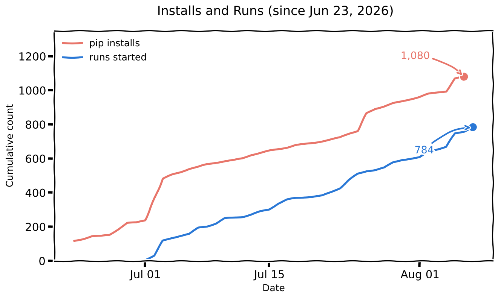

# Traction

## Recognition

  
  

[Trendshift](https://trendshift.io/repositories/29638) records GitHub trending placements. iFixAi's so far:

| Window | Rank | Scope | First achieved |
|---|---|---|---|
| Week | #1 | Python | Week 32, 2026 |
| Week | #13 | All languages | Week 32, 2026 |
| Day | #2 | Python | 4 Aug 2026 |
| Day | #8 | All languages | 25 Jul 2026 |

Both badges are served live from Trendshift's API, so they stay current without an edit here.

## Installs and runs

  

